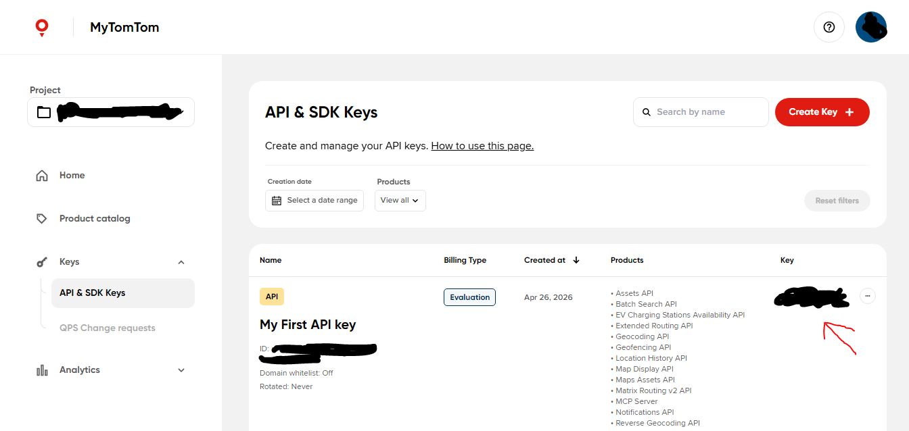

# Fito

Proyecto universitario de ingeniería de software, es un mapa interactivo que visualiza reportes de incidentes
en tiempo real.

## Dependencias

- Cordova (Compila código web para plataformas móviles)
- Vite (Empaquetador de dependencias)
- TomTom SDK (Para renderizar el mapa)

## Configuración

Instala las dependencias usando NPM:

```console
$ npm install
```

Crea una cuenta de TomTom en https://my.tomtom.com/ y copia la primera clave API que se crea
automaticamente:



Luego, crea un archivo .env en la carpeta 'www' con el siguiente contenido:

```env
VITE_TOMTOM_KEY=<tu-clave-API>
```

Al final, ejecuta el servidor con protocolo HTTPS y entra en el enlace que comienza con localhost:

```console
$ npm run dev -- --host
```
